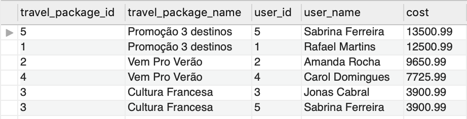
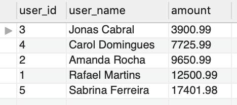

# Boas vindas ao repositório do projeto Queries Unite!

## O que foi desenvolvido

Realizado o modelo de um banco de dados do zero, fazendo todo o processo de leitura do problema, criação das entidades, atributos, relacionamentos, além de popular o banco de dados e providenciar queries para extrair as informações solicitadas.

---

## Desenvolvimento e entrega deste projeto

A seguir, tem-se a apresentação de um problema que deve ser resolvido com a modelagem de um novo banco de dados. Cada passo solicita um tipo de resposta diferente. Para cada desafio há um arquivo SQL que inclui sua solução nele.

1. Leia a pergunta e veja o arquivo chamado `desafioN.sql`, em que N é o número do desafio (exemplo: desafio3.sql).

2. O arquivo contém apenas o código SQL do desafio resolvido. 

---

### Problemas a sererem resolvidos

A gerência de sua empresa de desenvolvimento de software solicitou para você que um banco de dados seja projetado para a seguinte situação:

"Precisamos montar a estrutura do banco de dados que será usado no sistema de agendamento de viagens. A estrutura esperada para este módulo do sistema deve ser capaz de armazenar informações importantes sobre as pessoas que usam a aplicação, como: nome, idade e profissão. Devemos ter uma maneira de armazenar informações sobre as possíveis viagens que uma pessoa pode fazer, tais como: nome do pacote, destino (que deve conter no mínimo informações sobre a cidade e país de destino), data prevista de ida, data prevista de volta e custo total da viagem."

* Uma pessoa pode comprar mais de um pacote de viagens, mas **não** pode comprar o mesmo pacote duas ou mais vezes;

* Um pacote de viagens pode possuir mais de um destino;

* Um pacote de viagens deve possuir o campo `purchase_count` (contagem de compras), com o valor padrão de 0;

* Toda coluna que representa o identificador único dos registros de uma tabela deve ter seu valor gerado automaticamente de forma incremental, com exceção de tabelas que sejam agregações de outras tabelas (como é o caso da tabela `film_category` do banco `sakila`, por exemplo).

---

### Dados

Tendo em mente a descrição acima, a estrutura do banco de dados criado deve ser capaz de armazenar todas as informações abaixo:

* Rafael Martins, 33, Arquiteto, contratou o pacote "Promoção 3 destinos" no valor de R$12.500,99 e tem uma viagem programada para o dia 25/09/2022, com a volta prevista para o dia 12/10/2022. A viagem deve passar pelos seguintes destinos:
    - Cape Town, África do Sul;

    - Bali, Indonésia;

    - Marrakesh, Marrocos.

* Amanda Rocha, 25, Desenvolvedora de Software, contratou o pacote "Vem Pro Verão" no valor de R$9.650,99 e tem uma viagem programa para o dia 16/10/2022, com a volta prevista para o dia 26/10/2022. A viagem deve passar por dois destinos diferentes:
    - Paris, França;

    - Nova Iorque, Estados Unidos.

* Jonas Cabral, 18, Pintor, contratou o pacote "Cultura Francesa" no valor de R$3.900,99 e tem uma viagem programada para o dia 12/07/2022, com a volta prevista para o dia 20/07/2022. A viagem tem o destino único de:
    - Paris, França.

* Carol Domingues, 37, Contadora, contratou o pacote "Vem Pro Verão" no valor de R$7.725,99 e tem uma viagem programada para o dia 19/02/2022, com a volta prevista para o dia 26/03/2022. A viagem possui os seguintes destinos:
    - Cape Town, África do Sul;

    - Bali, Indonésia.

* Sabrina Ferreira, 45, Engenheira de Alimentos, contratou o pacote "Cultura Francesa" no valor de R$3.900,99 e tem uma viagem programada para o dia 12/07/2022, com a volta prevista para o dia 20/07/2022. A viagem tem o destino único de:
    - Paris, França.

* Sabrina Ferreira, 45, Engenheira de Alimentos, também contratou o pacote "Promoção 3 destinos" com o valor de R$13.500,99 e tem uma viagem programa para o dia 13/09/2022, com a volta prevista para o dia 18/10/2022. A viagem possui os seguintes destinos:
    - Marrakesh, Marrocos;

    - Nova Iorque, Estados Unidos;

    - Paris, França.

Mais adiante neste projeto, será solicitado a popular o banco de dados, com os dados acima.

---

### Identifique as entidades

Com base no problema apresentado anteriormente identifique as entidades presentes na história. Suas entidades devem representar:

* A pessoa (`users`);

* O pacote de viagens (`travel_packages`);

* O destino (`locations`);

* A agregação entre pacotes de viagens e destinos (`travel_packages_locations`);

* A compra de pacotes de viagens pelas pessoas (`purchases`).

Seu objetivo aqui é de ter essa informação em algum lugar, para que possa usar nos próximos passos.

---

### Identifique os atributos

Identifique e anote os atributos das entidades encontradas no passo anterior, com exceção de `users`, cujos atributos devem ser:

* `id`: Identificador único da pessoa;

* `full_name`: Nome completo da pessoa;

* `current_age`: Idade atual da pessoa;

* `current_job`: Profissão atual da pessoa.

---

### Identifique os relacionamentos

Identifique os relacionamentos entre cada uma das entidades.

Feito isso foi criado um diagrama de relacionamento das entidades `users`, `travel_packages`, `locations`, `travel_packages_locations` e `purchases`. Veja, a seguir, um exemplo de diagrama que demonstra relacionamentos entre entidades de forma visual.


Esta seção é crucial para que você consiga mapear e visualizar como uma entidade deve se relacionar com as outras. O objetivo aqui é de ter essa informação em algum lugar, para que possa usar nos próximos passos.

---

### Diagrama Entidade-Relacionamento detalhado

Criado um diagrama entidade-relacionamento contendo as informações sobre as entidades, atributos e relacionamentos.


---

## Desafio 1 - Providencie a estrutura do banco de dados

Providencie um único arquivo SQL com o nome de `desafio1.sql`, que ao ser executado deve:

* Criar o banco de dados de nome `queries_unite`, **em caixa baixa**;

* Definir o banco de dados `queries_unite` como ativo;

* Criar todas as tabelas necessárias;

* Popular o seu banco **somente** com as informações presentes na seção [**Dados**](#dados) (insira apenas os valores entregues, **não modifique-os** para CAIXA ALTA ou caixa baixa, insira-os **exatamente** como estão na descrição).

## Desafio 2 - Clone a tabela `users`

Crie um clone chamado `clone_troopers` para a tabela `users`.

## Desafio 3 - Altere a tabela `clone_troopers`

Faça as seguintes alterações na tabela `clone_troopers`:

* Adicione a coluna `nickname`, que deve ser do tipo `VARCHAR(50)`, não nulo;

* Altere a coluna `current_age`, de forma que seu tipo passe a ser `TINYINT`;

* Altere o nome da coluna `full_name` para `origin_name` e garanta que não seja possível inserir nomes repetidos;

* Exclua a coluna `current_job`.

## Desafio 4 - Exclua a tabela `clone_troopers`

Exclua a tabela `clone_troopers`.

## Desafio 5 - VIEW travel_package_info

Crie uma `VIEW` chamada `travel_package_info`, que deve mostrar todas as compras cadastradas no sistema, exibindo os resultados da seguinte forma:

* `travel_package_id`: Identificação única do pacote de viagens;

* `travel_package_name`: Nome do pacote de viagens;

* `user_id`: Identificação única da pessoa;

* `user_name`: Nome da pessoa;

* `cost`: Custo total da viagem.

Os resultados da `VIEW` devem ser ordenados pelo custo total das viagens de forma decrescente. Ao fazer uma pesquisa em sua `VIEW` sem filtros você deve produzir os mesmos resultados da imagem a seguir:



## Desafio 6 - VIEW amount_spent_by_user

Crie uma `VIEW` chamada `amount_spent_by_user`, que mostre o nome e total gasto em viagens até o momento por todos as pessoas presentes no sistema, conforme as especificações a seguir:

* `user_id`: Identificação única da pessoa;

* `user_name`: Nome da pessoa;

* `amount`: Total gasto pela pessoa.

Os gastos devem estar agrupados e ordenados de forma crescente. Ao fazer uma pesquisa em sua `VIEW` sem filtros você deve produzir os mesmos resultados da imagem a seguir.



## Desafio 7 - VIEW top_3_locations

Crie uma `VIEW` chamada `top_3_locations`, que exibe os top 3 destinos mais frequentados, de acordo com as especificações a seguir:

* `id`: Identificação única da localização;

* `city`: Nome da cidade;

* `country`: Nome do país;

* `travel_amount`: Quantidade de visitas à localização.

Os resultados devem ser agrupados pela coluna identificadora do destino e ordenados pela quantidade de visitas à localização, de forma decrescente. Caso haja mais de uma localização com a mesma quantidade de visitas, o critério de desempate será a ordenação pelo id da localização, de forma crescente. Ao fazer uma pesquisa em sua `VIEW` sem filtros você deve produzir os mesmos resultados da imagem a seguir.


## Desafio 8 - VIEW revenue_report

Crie uma nova `VIEW` chamada `revenue_report`, que deve exibir um relatório de lucros com as seguintes informações:

* `lowest_revenue`: Menor lucro, individual, obtido com um pacote de viagens;

* `biggest_revenue`: Lucro máximo, individual, obtido com um pacote de viagens;

* `average_revenue`: Lucro médio obtido com todos os pacotes de viagens;

* `total_revenue`: Lucro total obtido com todos os pacotes de viagens.

**Dica:** Recomenda-se fazer uso de subquery para resolver este desafio.

Ao fazer uma pesquisa em sua `VIEW` sem filtros você deve produzir os mesmos resultados da imagem a seguir.


## Desafio 9 - PROCEDURE find_travel_packages_by_period

Você deve criar uma `PROCEDURE` chamada `find_travel_packages_by_period`, que simula a funcionalidade de busca com filtros. Essa `PROCEDURE` deve receber 2 parâmetros de entrada: a data prevista de ida e a data previsa de volta. Ao ser executada ela deve retornar somente os resultados contidos dentro da faixa de datas especificadas.

Para validar sua `PROCEDURE`, execute-a com os parâmetros data inicial e data final, com os respectivos valores de 17/07/2022 (`'2022-07-17'`) e 25/10/2022 (`'2022-10-25'`). O resultado deve ser exatamente igual ao da imagem abaixo:


## Desafio 10 - FUNCTION average_amount_spent_given_age_range

Você deve criar uma `FUNCTION` chamada `average_amount_spent_given_age_range`, que recebe como parâmetros uma idade mínima e uma idade máxima. Sua `FUNCTION` deve retornar apenas o valor médio gasto em compras de pacotes nessa faixa etária. O resultado retornado pelo cálculo deve ser do tipo `DOUBLE`.

Para validar sua `FUNCTION`, execute-a com os parâmetros idade mínima e idade máxima, com os respectivos valores de 30 e 50 anos. O resultado deve ser exatamente igual ao da imagem abaixo:


## Desafio 11 - TRIGGER increment_travel_package_purchases

Você deve criar um `TRIGGER` chamado `increment_travel_package_purchases`, que será disparado a cada nova compra de um pacote de viagens. Quando disparado, esse `TRIGGER` deve incrementar em um a quantidade de compras do pacote definida na coluna `purchase_count`.

Para validar seu `TRIGGER`, crie-o antes de inserir seus dados no banco. Caso você já tenha populado o banco, você pode excluí-lo e gerá-lo novamente, tendo definido o `TRIGGER` antes dos comandos de inserção de dados.

Uma vez populado o banco já com o `TRIGGER` definido, execute a query:
```sql
SELECT
    id,
    purchase_count
FROM queries_unite.travel_packages;
```
O resultado esperado para essa consulta é:


## Desafio 12 - INDEX users_full_name_index

Para facilitar a busca por pessoas cadastradas no sistema, adicione um `INDEX` chamado `users_full_name_index` na coluna `full_name` da tabela `users`.

## Desafio 13 - FULLTEXT INDEX users_current_job_index

Para facilitar estudos internos do perfil das pessoas que compram os pacotes de viagens, adicione um `FULLTEXT INDEX` chamado `users_current_job_index` na coluna `current_job` da tabela `users`.

---
